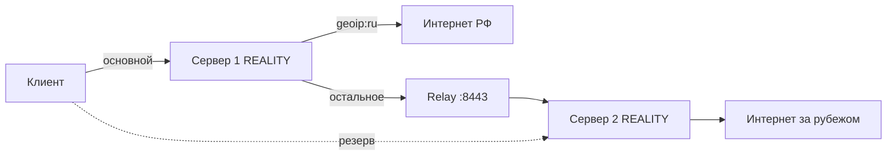

# VPN-XRAY Dual: два сервера с разделением трафика по РФ

Расширение [VPN-XRAY](https://github.com/esovgirenko/VPN-XRAY).

| Подключение | Поведение |
|-------------|-----------|
| **Сервер 1** (основной) | IP/домены РФ → интернет через сервер 1; остальное → через сервер 2 |
| **Сервер 2** (резерв) | Весь трафик за рубежом (если сервер 1 недоступен) |

## Быстрый старт (сервер 2 уже с VPN-XRAY)

### Шаг 1 — Патч сервера 2 (зарубежный VPS, без переустановки)

На VPS, где уже работает `install-reality.sh`:

```bash
cd /opt/vpn-xray/dual-server   # или путь к репозиторию
chmod +x patch-server2.sh lib/common.sh
sudo ./patch-server2.sh --server1-ip IP_СЕРВЕРА_1
```

Скрипт:
- создаёт резервную копию `config.json`;
- **не меняет** REALITY :443 и `reality-client-params.json`;
- добавляет relay inbound `:8443` для сервера 1;
- пишет `relay-server1-params.json`.

Скачайте файл на ПК:

```bash
scp root@SERVER2_IP:/usr/local/etc/xray/relay-server1-params.json .
```

### Шаг 2 — Установка сервера 1 (новый VPS в РФ)

```bash
scp relay-server1-params.json root@SERVER1_IP:/usr/local/etc/xray/
ssh root@SERVER1_IP
cd /opt/vpn-xray/dual-server
chmod +x install-server1.sh lib/common.sh
sudo ./install-server1.sh -y
```

Скачайте параметры основного профиля:

```bash
scp root@SERVER1_IP:/usr/local/etc/xray/reality-client-params.json ./server1-client-params.json
```

Резервный профиль — тот же, что уже был на сервере 2:

```bash
scp root@SERVER2_IP:/usr/local/etc/xray/reality-client-params.json ./server2-client-params.json
```

### Шаг 3 — Ссылки для телефона / ПК

```bash
cd vpn-xray/client && ./setup-venv.sh
cd ../dual-server/client
../../client/.venv/bin/python dual-link-gen.py \
  /path/to/server1-client-params.json \
  /path/to/server2-client-params.json
```

Два профиля в v2rayNG / Streisand / v2rayN:
1. **VPN-Server1-RU-split** — основной
2. **VPN-Server2-Fallback** — если сервер 1 недоступен

---

## Скрипты

| Скрипт | Где запускать | Назначение |
|--------|---------------|------------|
| `patch-server2.sh` | Сервер 2 (уже с VPN-XRAY) | Добавить relay, не трогая клиентов |
| `install-server1.sh` | Сервер 1 (новый VPS) | Полная установка с geo-маршрутизацией |
| `install-server2.sh` | Только чистый VPS | Полная установка с нуля (если VPN ещё нет) |

### Опции patch-server2.sh

```bash
sudo ./patch-server2.sh --server1-ip 203.0.113.1   # UFW: 8443 только с сервера 1
sudo ./patch-server2.sh --relay-port 8443
```

Повторный запуск безопасен: relay не дублируется.

### Опции install-server1.sh

```bash
sudo ./install-server1.sh --relay-file /usr/local/etc/xray/relay-server1-params.json -y
```

---

## Схема



## Откат на сервере 2

```bash
sudo cp /usr/local/etc/xray/config.json.bak.XXXXXXXX /usr/local/etc/xray/config.json
sudo systemctl restart xray
```

## Примечания

- Relay между серверами: VLESS + TLS (самоподписанный сертификат).
- Geo-списки на сервере 1: `geoip.dat` / `geosite.dat` (Loyalsoldier).
- Юридическая ответственность за использование VPN — на пользователе.
