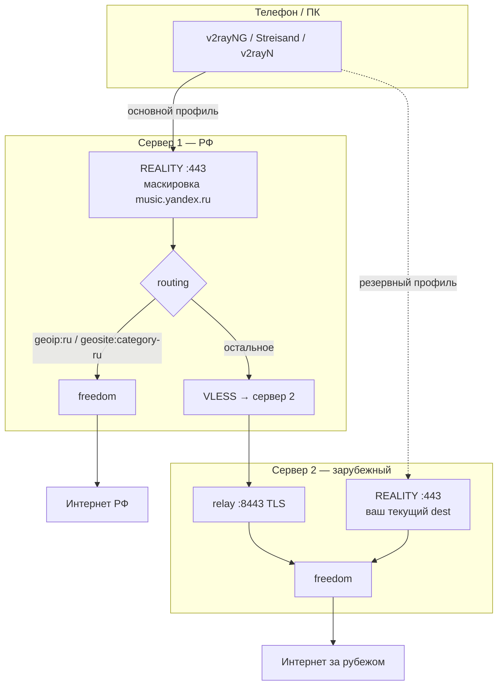

# VPN-XRAY Dual: два сервера, split по РФ

Расширение [VPN-XRAY-Dual](https://github.com/esovgirenko/VPN-XRAY-Dual) для схемы «вход в РФ + выход за рубежом через второй VPS».

| Подключение | Куда подключается клиент | Куда уходит трафик |
|-------------|--------------------------|-------------------|
| **Основной** | Сервер 1 (VPS в РФ) | `geoip:ru` / `geosite:category-ru` → интернет через сервер 1; остальное → relay → сервер 2 |
| **Резерв** | Сервер 2 (зарубежный VPS) | Весь трафик → интернет за рубежом (если сервер 1 недоступен) |

Протокол клиента: **VLESS + REALITY + xtls-rprx-vision**. Между серверами: **VLESS + TLS** на порту **8443**.

---

## Оглавление

- [Схема](#схема)
- [Требования](#требования)
- [Быстрый старт](#быстрый-старт)
- [Скрипты](#скрипты)
- [Маскировка TLS (сервер 1)](#маскировка-tls-сервер-1)
- [Клиенты](#клиенты)
- [Проверка](#проверка)
- [Файлы на серверах](#файлы-на-серверах)
- [Смена dest / откат](#смена-dest--откат)
- [Устранение неполадок](#устранение-неполадок)

---

## Схема



---

## Требования

| Узел | Расположение | Софт | Порты |
|------|--------------|------|-------|
| **Сервер 2** | За рубежом | Уже установлен [VPN-XRAY](../README.md) (`install-reality.sh`) | 443 (клиенты), **8443** (relay с сервера 1) |
| **Сервер 1** | РФ (или ближе к РФ) | Чистый VPS, Ubuntu 22.04 / Debian 12 | 443 (клиенты) |

На сервере 1 при установке скачиваются `geoip.dat` / `geosite.dat` (Loyalsoldier) для маршрутизации.

---

## Быстрый старт

### 0. Клонирование (на оба VPS или на ПК)

```bash
git clone https://github.com/esovgirenko/VPN-XRAY-Dual.git
cd VPN-XRAY-Dual
```

### 1. Сервер 2 — патч (без переустановки VPN)

На VPS, где **уже работает** `server/install-reality.sh`:

```bash
cd VPN-XRAY-Dual
chmod +x patch-server2.sh dual-server/lib/common.sh
sudo ./patch-server2.sh --server1-ip IP_СЕРВЕРА_1
```

Скрипты можно запускать и из `dual-server/` (см. пути в таблице ниже).

Скрипт:
- создаёт `config.json.bak.ДАТА`;
- **не меняет** REALITY :443 и `reality-client-params.json`;
- добавляет inbound `relay-in` на порту **8443**;
- записывает `/usr/local/etc/xray/relay-server1-params.json`;
- в UFW открывает 8443 **только** с IP сервера 1 (если указан `--server1-ip`).

Скачайте файл на ПК:

```bash
scp root@SERVER2_IP:/usr/local/etc/xray/relay-server1-params.json .
scp root@SERVER2_IP:/usr/local/etc/xray/reality-client-params.json ./server2-client-params.json
```

### 2. Сервер 1 — установка

```bash
scp relay-server1-params.json root@SERVER1_IP:/usr/local/etc/xray/
ssh root@SERVER1_IP
cd VPN-XRAY-Dual
chmod +x install-server1.sh dual-server/lib/common.sh
sudo ./install-server1.sh -y
```

Скачайте параметры **нового** основного профиля:

```bash
scp root@SERVER1_IP:/usr/local/etc/xray/reality-client-params.json ./server1-client-params.json
```

### 3. Ссылки для телефона / ПК

```bash
cd VPN-XRAY-Dual/client
./setup-venv.sh
cd ../dual-server/client
../../client/.venv/bin/python dual-link-gen.py \
  /path/to/server1-client-params.json \
  /path/to/server2-client-params.json
```

Импортируйте **два** профиля:

| Имя в клиенте | Файл параметров | Назначение |
|---------------|-----------------|------------|
| `VPN-Server1-RU-split` | `server1-client-params.json` | Основной, по умолчанию |
| `VPN-Server2-Fallback` | `server2-client-params.json` | Если сервер 1 недоступен |

В приложении включите **глобальный режим** (весь трафик через VPN). Split по РФ выполняется **на сервере 1**, не на телефоне.

---

## Скрипты

| Скрипт | Где | Назначение |
|--------|-----|------------|
| **`patch-server2.sh`** | Сервер 2 (VPN уже есть) | Добавить relay, не трогая клиентов |
| **`install-server1.sh`** | Сервер 1 (новый VPS) | REALITY + geo-маршрутизация + outbound на сервер 2 |
| `install-server2.sh` | Чистый VPS за рубежом | Полная установка, если VPN ещё нет |

### patch-server2.sh

```bash
sudo ./patch-server2.sh --server1-ip 203.0.113.1   # UFW: 8443 только с сервера 1
sudo ./patch-server2.sh --relay-port 8443
sudo ./patch-server2.sh -h
```

Повторный запуск **безопасен**: inbound `relay-in` не дублируется.

### install-server1.sh

```bash
sudo ./install-server1.sh
sudo ./install-server1.sh --relay-file /usr/local/etc/xray/relay-server1-params.json -y
sudo ./install-server1.sh -h
```

| Опция | Описание |
|-------|----------|
| `--relay-file PATH` | `relay-server1-params.json` с сервера 2 (иначе ищется в `/usr/local/etc/xray/`) |
| `-y`, `--yes` | Порт 443, dest **music.yandex.ru**, fingerprint **chrome**, 1 пользователь |

Переменные окружения (переопределение dest):

```bash
REALITY_DEST_DEFAULT="music.yandex.ru:443" \
REALITY_SNI_DEFAULT="music.yandex.ru" \
sudo ./install-server1.sh -y
```

---

## Маскировка TLS (сервер 1)

По умолчанию REALITY на сервере 1 маскируется под **[Яндекс Музыку](https://music.yandex.ru)**:

| Параметр | Значение |
|----------|----------|
| **dest** | `music.yandex.ru:443` |
| **serverNames** | `music.yandex.ru` |
| **fingerprint** (клиент) | `chrome` (рекомендуется) |

Это выглядит естественно для VPS в РФ. Сервер 2 остаётся с **вашим** dest из первоначальной установки (Cloudflare и т.д.).

Проверка TLS dest с ПК:

```bash
cd VPN-XRAY-Dual
./test/verify-tls.sh IP_СЕРВЕРА_1 443 music.yandex.ru
```

---

## Клиенты

Требуется **REALITY**, **VLESS**, flow **xtls-rprx-vision**.

| Платформа | Приложения |
|-----------|------------|
| iOS | Streisand, V2Box, Shadowrocket |
| Android | v2rayNG, NekoBox |
| macOS | V2rayU, FoXray, Nekoray |
| Windows | v2rayN |

Подробнее про настройку iPhone/Mac: [основной README](../README.md#подключение-на-iphone-и-macbook).

**Одна ссылка (только сервер 1):**

```bash
python3 client/reality-link-gen.py server1-client-params.json --link --qr
```

---

## Проверка

### Сервисы на VPS

```bash
sudo systemctl status xray
sudo xray run -test -config /usr/local/etc/xray/config.json
journalctl -u xray -n 50 --no-pager
```

### Маршрутизация (подключены к серверу 1)

Точные IP зависят от geo-баз. Ориентиры:

- Сайты в РФ (например `yandex.ru`, `2ip.ru`) — выход с IP сервера 1 / провайдера РФ.
- Зарубежные (например `ifconfig.me`, `google.com`) — IP сервера 2.

### Резерв (сервер 2)

Весь трафик должен выходить с зарубежного IP сервера 2 — как до включения Dual.

---

## Файлы на серверах

| Путь | Сервер | Описание |
|------|--------|----------|
| `/usr/local/etc/xray/config.json` | 1, 2 | Конфиг Xray |
| `reality-client-params.json` | 1 | Параметры **основного** профиля (новые UUID/ключи) |
| `reality-client-params.json` | 2 | Параметры **резервного** профиля (без изменений после patch) |
| `relay-server1-params.json` | 2 | UUID/порт relay для установки сервера 1 |
| `relay-server1-params.json` | 1 | Копия с сервера 2 (при установке) |
| `config.json.bak.*` | 2 | Бэкап до `patch-server2.sh` |
| `geoip.dat`, `geosite.dat` | 1 | Geo-списки для routing |

---

## Смена dest / откат

### Сменить маскировку на сервере 1 (уже установлен)

```bash
sudo bash /opt/VPN-XRAY-Dual/server/change-dest.sh "music.yandex.ru:443" "music.yandex.ru"
```

Перегенерируйте ссылку: `reality-link-gen.py` с новым `reality-client-params.json` (поле `serverName` должно совпадать с SNI).

### Откат патча на сервере 2

```bash
sudo cp /usr/local/etc/xray/config.json.bak.XXXXXXXX /usr/local/etc/xray/config.json
sudo systemctl restart xray
```

Имя бэкапа смотрите: `ls /usr/local/etc/xray/config.json.bak.*`

---

## Устранение неполадок

| Симптом | Что проверить |
|---------|----------------|
| Сервер 1 не поднимается | `xray run -test -config ...`; есть ли `relay-server1-params.json` |
| Зарубежные сайты не открываются | Relay: порт 8443 открыт на сервере 2 **с IP сервера 1**; UUID в outbound сервера 1 = relay на сервере 2 |
| Всё идёт через зарубежье с сервера 1 | Установлены ли `geoip.dat` / `geosite.dat` на сервере 1 |
| Клиент не подключается к серверу 1 | SNI в ссылке = `music.yandex.ru`; fingerprint `chrome`; порт 443 |
| После patch сервер 2 сломался | Откат из `config.json.bak.*`; `journalctl -u xray` |

Производительность, BBR, смена порта: [основной README](../README.md#производительность-и-низкая-скорость).

---

## Юридическое предупреждение

Использование должно соответствовать законодательству вашей страны. Автор не несёт ответственности за неправомерное применение.
