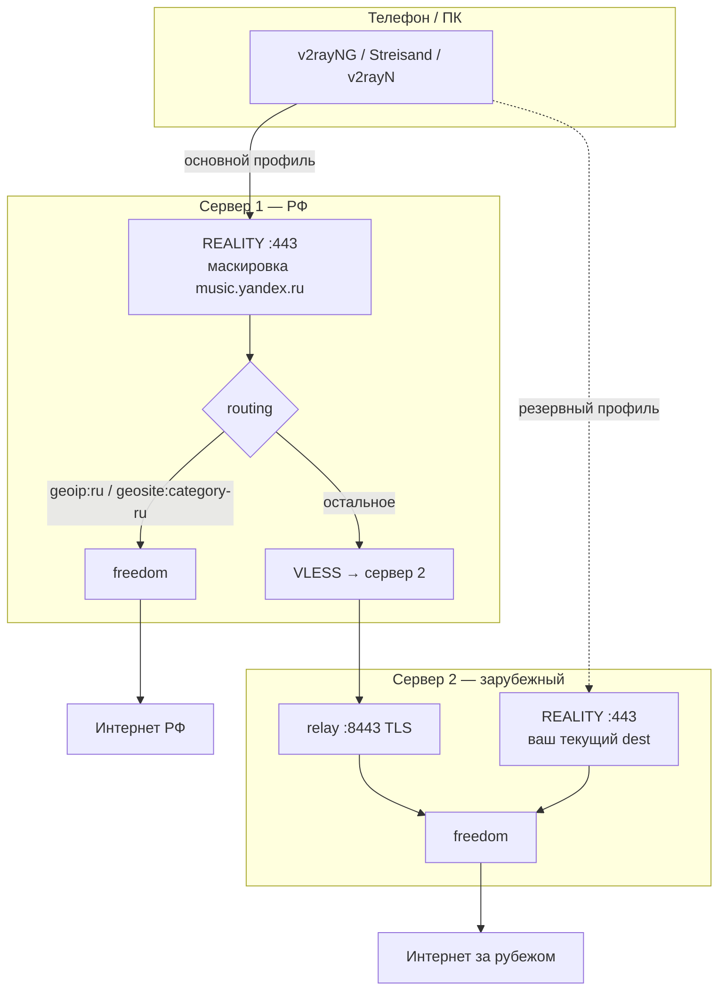

# VPN-XRAY Dual: два сервера, split по РФ

Расширение [VPN-XRAY-Dual](https://github.com/esovgirenko/VPN-XRAY-Dual) для схемы «вход в РФ + выход за рубежом через второй VPS».

| Подключение | Куда подключается клиент | Куда уходит трафик |
|-------------|--------------------------|-------------------|
| **Основной** | Сервер 1 (VPS в РФ) | `geoip:ru` / `geosite:category-ru` → интернет через сервер 1; остальное → relay → сервер 2 |
| **Резерв** | Сервер 2 (зарубежный VPS) | Весь трафик → интернет за рубежом (если сервер 1 недоступен) |

Протокол клиента: **VLESS + REALITY + xtls-rprx-vision**. Между серверами: **VLESS + TLS** на порту **8443**.

---

## Оглавление

- [Схема](#схема)
- [Требования](#требования)
- [Быстрый старт](#быстрый-старт)
- [Скрипты](#скрипты)
- [Маскировка TLS (сервер 1)](#маскировка-tls-сервер-1)
- [Клиенты](#клиенты)
- [Мобильные «белые списки» оператора](#мобильные-белые-списки-оператора)
- [Firewall (хостинг + UFW)](#firewall-хостинг--ufw)
- [Проверка](#проверка)
- [Файлы на серверах](#файлы-на-серверах)
- [Смена dest / откат](#смена-dest--откат)
- [Устранение неполадок](#устранение-неполадок)

---

## Схема



---

## Требования

| Узел | Расположение | Софт | Порты |
|------|--------------|------|-------|
| **Сервер 2** | За рубежом | Уже установлен [VPN-XRAY](../README.md) (`install-reality.sh`) | **443** (клиенты), **8443** (relay только с IP сервера 1) |
| **Сервер 1** | РФ (или ближе к РФ) | Чистый VPS, Ubuntu 22.04 / Debian 12 | **443** (клиенты) |

На сервере 1 скачиваются `geoip.dat` / `geosite.dat` (Loyalsoldier). В routing используется **`geosite:category-ru`** (не `geosite:ru` — такого тега в Loyalsoldier нет).

**Важно:** откройте порты и в **панели хостинга**, и в **UFW** на VPS (см. [Firewall](#firewall-хостинг--ufw)).

---

## Быстрый старт

### 0. Клонирование (на оба VPS или на ПК)

```bash
git clone https://github.com/esovgirenko/VPN-XRAY-Dual.git
cd VPN-XRAY-Dual
```

### 1. Сервер 2 — патч (без переустановки VPN)

На VPS, где **уже работает** `server/install-reality.sh`:

```bash
cd VPN-XRAY-Dual
chmod +x patch-server2.sh dual-server/lib/common.sh
sudo ./patch-server2.sh --server1-ip IP_СЕРВЕРА_1
```

Скрипты можно запускать и из `dual-server/` (см. пути в таблице ниже).

Скрипт:
- создаёт `config.json.bak.ДАТА`;
- **не меняет** REALITY :443 и `reality-client-params.json`;
- добавляет inbound `relay-in` на порту **8443**;
- записывает `/usr/local/etc/xray/relay-server1-params.json`;
- в UFW открывает 8443 **только** с IP сервера 1 (если указан `--server1-ip`).

Скачайте файл на ПК (подставьте пользователя и порт SSH; для `sudo` — см. [копирование файлов](#копирование-файлов-с-сервера)):

```bash
scp -P 22 user@SERVER2_IP:~/relay-server1-params.json .
# или с сервера после: sudo cp ... ~/relay-server1-params.json && sudo chown $USER:$USER ~/relay-server1-params.json
```

### 2. Сервер 1 — установка

Файл relay должен лежать в **каталоге** `/usr/local/etc/xray/`, не как файл `/usr/local/etc/xray`:

```bash
# на сервере 1:
sudo mkdir -p /usr/local/etc/xray
sudo cp relay-server1-params.json /usr/local/etc/xray/
sudo chmod 600 /usr/local/etc/xray/relay-server1-params.json
```

Установка (из **корня** репозитория или из `dual-server/`):

```bash
ssh user@SERVER1_IP
cd ~/VPN-XRAY-Dual
chmod +x install-server1.sh dual-server/lib/common.sh
sudo ./install-server1.sh -y
```

Если установка оборвалась, но `config.json` уже есть:

```bash
cd ~/VPN-XRAY-Dual/dual-server
sudo ./export-client-params.sh   # создаст reality-client-params.json
```

Скачайте параметры **основного** профиля на ПК — см. [копирование](#копирование-файлов-с-сервера).

### 3. Ссылки для телефона / ПК

```bash
cd VPN-XRAY-Dual/client
./setup-venv.sh
cd ../dual-server/client
../../client/.venv/bin/python dual-link-gen.py \
  /path/to/server1-client-params.json \
  /path/to/server2-client-params.json
```

Импортируйте **два** профиля:

| Имя в клиенте | Файл параметров | Назначение |
|---------------|-----------------|------------|
| `VPN-Server1-RU-split` | `server1-client-params.json` | Основной, по умолчанию |
| `VPN-Server2-Fallback` | `server2-client-params.json` | Если сервер 1 недоступен |

В приложении включите **глобальный режим** (весь трафик через VPN). Split по РФ выполняется **на сервере 1**, не на телефоне.

---

## Скрипты

| Скрипт | Где | Назначение |
|--------|-----|------------|
| **`patch-server2.sh`** | Корень репо или `dual-server/` на сервере 2 | Добавить relay, не трогая клиентов |
| **`install-server1.sh`** | Корень репо или `dual-server/` на сервере 1 | REALITY + geo-маршрутизация + outbound на сервер 2 |
| `export-relay-params.sh` | Сервер 2 | Восстановить `relay-server1-params.json` из config |
| `export-client-params.sh` | Сервер 1 | Восстановить `reality-client-params.json` из config |
| `install-server2.sh` | Чистый VPS за рубежом | Полная установка, если VPN ещё нет |

В корне репозитория есть обёртки `install-server1.sh` и `patch-server2.sh` (делегируют в `dual-server/`).

### patch-server2.sh

```bash
sudo ./patch-server2.sh --server1-ip 203.0.113.1   # UFW: 8443 только с сервера 1
sudo ./patch-server2.sh --relay-port 8443
sudo ./patch-server2.sh -h
```

Повторный запуск **безопасен**: inbound `relay-in` не дублируется.

### install-server1.sh

```bash
sudo ./install-server1.sh
sudo ./install-server1.sh --relay-file /usr/local/etc/xray/relay-server1-params.json -y
sudo ./install-server1.sh -h
```

| Опция | Описание |
|-------|----------|
| `--relay-file PATH` | `relay-server1-params.json` с сервера 2 (иначе ищется в `/usr/local/etc/xray/`) |
| `-y`, `--yes` | Порт 443, dest **music.yandex.ru**, fingerprint **chrome**, 1 пользователь |

Переменные окружения (переопределение dest):

```bash
REALITY_DEST_DEFAULT="music.yandex.ru:443" \
REALITY_SNI_DEFAULT="music.yandex.ru" \
sudo ./install-server1.sh -y
```

---

## Маскировка TLS (сервер 1)

По умолчанию REALITY на сервере 1 маскируется под **[Яндекс Музыку](https://music.yandex.ru)**:

| Параметр | Значение |
|----------|----------|
| **dest** | `music.yandex.ru:443` |
| **serverNames** | `music.yandex.ru` |
| **fingerprint** (клиент) | `chrome` (рекомендуется) |

Это выглядит естественно для VPS в РФ. Сервер 2 остаётся с **вашим** dest из первоначальной установки (Cloudflare и т.д.).

Проверка TLS dest с ПК:

```bash
cd VPN-XRAY-Dual
./test/verify-tls.sh IP_СЕРВЕРА_1 443 music.yandex.ru
```

---

## Клиенты

Требуется **REALITY**, **VLESS**, flow **xtls-rprx-vision**.

| Платформа | Приложения |
|-----------|------------|
| iOS | Streisand, V2Box, Shadowrocket |
| Android | v2rayNG, NekoBox |
| macOS | V2rayU, FoXray, Nekoray |
| Windows | v2rayN |

Подробнее про настройку iPhone/Mac: [основной README](../README.md#подключение-на-iphone-и-macbook).

**Одна ссылка (только сервер 1):**

```bash
python3 client/reality-link-gen.py server1-client-params.json --link --qr
```

---

## Мобильные «белые списки» оператора

Если на **Wi‑Fi** VPN работает, а на **мобильной сети** — нет, включите отдельный профиль:

```bash
sudo ./enable-mobile-whitelist.sh --dest vk
```

Подробно: **[WHITELIST_MOBILE.md](WHITELIST_MOBILE.md)** (SNI vs блокировка по IP, порты, presets).

---

## Firewall (хостинг + UFW)

Нужны **оба** уровня: панель провайдера и UFW на Linux.

### Сервер 1 (РФ, входной)

| Где | Правило |
|-----|---------|
| Панель хостинга | Входящий **TCP 443** |
| UFW | `sudo ufw allow 443/tcp` |

### Сервер 2 (зарубежный)

| Где | Правило |
|-----|---------|
| Панель хостинга | Входящий **TCP 443** (резервные клиенты) |
| Панель хостинга | Входящий **TCP 8443** с IP сервера 1 (или с любого IP на время отладки) |
| UFW | `sudo ufw allow 443/tcp` |
| UFW | **`sudo ufw allow from IP_СЕРВЕРА_1 to any port 8443 proto tcp`** |

Без правила **8443** типичная картина: VPN «подключается», в логах сервера 1 есть `reality-in -> proxy-abroad`, но **зарубежные сайты не открываются**.

Проверка relay с сервера 1:

```bash
nc -vz IP_СЕРВЕРА_2 8443
```

`patch-server2.sh --server1-ip IP_СЕРВЕРА_1` добавляет правило UFW автоматически; панель хостинга настраивается вручную.

---

## Проверка

### Сервисы на VPS

```bash
sudo systemctl status xray
sudo XRAY_LOCATION_ASSET=/usr/local/etc/xray /usr/local/bin/xray run -test -config /usr/local/etc/xray/config.json
sudo journalctl -u xray -n 50 --no-pager
```

Успешное подключение клиента в логах сервера 1:

```text
from IP:PORT accepted tcp:... [reality-in -> proxy-abroad]   # зарубежный трафик
from IP:PORT accepted tcp:... [reality-in -> direct]       # RU / локальный
```

### Маршрутизация (подключены к серверу 1)

Точные IP зависят от geo-баз. Ориентиры:

- Сайты в РФ (например `yandex.ru`, `2ip.ru`) — выход с IP сервера 1 / провайдера РФ.
- Зарубежные (например `ifconfig.me`, `google.com`) — IP сервера 2.

### Резерв (сервер 2)

Весь трафик должен выходить с зарубежного IP сервера 2 — как до включения Dual.

---

## Файлы на серверах

| Путь | Сервер | Описание |
|------|--------|----------|
| `/usr/local/etc/xray/config.json` | 1, 2 | Конфиг Xray |
| `reality-client-params.json` | 1 | Параметры **основного** профиля (новые UUID/ключи) |
| `reality-client-params.json` | 2 | Параметры **резервного** профиля (без изменений после patch) |
| `relay-server1-params.json` | 2 | UUID/порт relay для установки сервера 1 |
| `relay-server1-params.json` | 1 | Копия с сервера 2 (при установке) |
| `config.json.bak.*` | 2 | Бэкап до `patch-server2.sh` |
| `geoip.dat`, `geosite.dat` | 1 | Geo-списки для routing |

---

## Смена dest / откат

### Сменить маскировку на сервере 1 (уже установлен)

```bash
sudo bash /opt/VPN-XRAY-Dual/server/change-dest.sh "music.yandex.ru:443" "music.yandex.ru"
```

Перегенерируйте ссылку: `reality-link-gen.py` с новым `reality-client-params.json` (поле `serverName` должно совпадать с SNI).

### Откат патча на сервере 2

```bash
sudo cp /usr/local/etc/xray/config.json.bak.XXXXXXXX /usr/local/etc/xray/config.json
sudo systemctl restart xray
```

Имя бэкапа смотрите: `ls /usr/local/etc/xray/config.json.bak.*`

---

## Копирование файлов с сервера

Файлы в `/usr/local/etc/xray/` принадлежат root (`chmod 600`). Для `scp` скопируйте в домашний каталог:

```bash
# на VPS:
sudo cp /usr/local/etc/xray/reality-client-params.json ~/
sudo chown $USER:$USER ~/reality-client-params.json

# на Mac (порт SSH — заглавная P):
scp -P 22 user@SERVER_IP:~/reality-client-params.json ./server1-client-params.json
```

Через SSH без scp:

```bash
ssh -t -p 22 user@SERVER_IP \
  "sudo cat /usr/local/etc/xray/reality-client-params.json" \
  > ./server1-client-params.json
```

(`-t` нужен для ввода пароля `sudo`)

---

## Устранение неполадок

| Симптом | Что проверить |
|---------|----------------|
| VPN подключается, **интернета нет** / только РФ | **UFW и панель хостинга: TCP 8443** на сервере 2 с IP сервера 1; `nc -vz SERVER2 8443` с сервера 1 |
| `reality-in -> proxy-abroad` в логах, сайты не грузятся | То же — relay до сервера 2 |
| Сервер 1: `geoip.dat: no such file` | `XRAY_LOCATION_ASSET=/usr/local/etc/xray` в systemd; симлинки в `/usr/local/bin/` (делает `install-server1.sh`) |
| `geosite:ru` / `code not found: RU` | В конфиге должно быть `geosite:category-ru`, не `geosite:ru` |
| Нет `reality-client-params.json` | `sudo ./export-client-params.sh` на сервере 1 |
| Нет `relay-server1-params.json` | `sudo ./export-relay-params.sh` или `sudo ./patch-server2.sh` на сервере 2 |
| `cp: same file` при install-server1 | Relay уже в `/usr/local/etc/xray/` — нормально после `git pull` |
| Клиент не подключается к серверу 1 | Панель: **TCP 443**; SNI `music.yandex.ru`; актуальный UUID из последнего `reality-client-params.json` |
| Резерв работает, основной нет | Закрыт 443 на сервере 1 или неверная ссылка на сервер 1 |
| После patch сервер 2 сломался | Откат: `config.json.bak.*`; `journalctl -u xray` |

Производительность, BBR, смена порта: [основной README](../README.md#производительность-и-низкая-скорость).

---

## Юридическое предупреждение

Использование должно соответствовать законодательству вашей страны. Автор не несёт ответственности за неправомерное применение.
